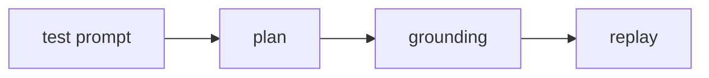

import { Steps, Tabs, TabItem, FileTree, Badge, LinkCard } from '@astrojs/starlight/components';

# ドキュメントブロックの実例

ambercastのテストプロンプトは意図を記述する原本である。生成されたplanとgroundingをレビューし、その後のreplayではAIを呼び出さない。

| ファイル | 役割 |
| --- | --- |
| `login.test.md` | ログインの期待する振る舞いを記述する |
| `login.ambercast.plan.json` | 再現可能な実行手順を保持する |
| `login.ambercast.grounding.json` | UI要素への対応を保持する |

<FileTree>

- tests/
  - login.test.md
  - login.ambercast.plan.json
  - login.ambercast.grounding.json

</FileTree>

<Steps>

1. ## プロンプトを書く \{#write-prompt}

   ユーザーがログインした後に表示される画面を、`login.test.md`に記述する。

2. ## planを生成する \{#generate-plan}

   `generate`でplanとgroundingを生成し、差分をレビューする。

3. ## replayを実行する \{#run-replay}

   `run`で確定済みのplanを再生する。UIが変わった場合は`heal`の結果を確認する。

</Steps>

<Tabs syncKey="agent">

<TabItem label="Claude">

Claude Codeではambercastのスキルを使い、プロンプトの意図とplanの差分を確認する。

</TabItem>

<TabItem label="Codex">

Codexでも同じプロンプトとplanを確認する。replayの入力はエージェントによって変えない。

</TabItem>

</Tabs>

```bash frame="terminal"
ambercast generate tests/login.test.md
ambercast run tests/login.test.md
```

```md title="tests/login.test.md" showLineNumbers
# Login

Log in as a registered user and confirm the account page is visible.
```

行マーカーは、プロンプトとplanのレビューで注目する行を示す例である。

```js ins={2}
const prompt = 'Log in as a registered user';
const plan = generate(prompt);
```

```js del={2}
const plan = loadPlan('login');
plan.steps = guessSelectorsAtReplayTime();
```

```js mark={2} collapse={2-3}
const plan = loadPlan('login');
verifyInputsDigest(plan);
replay(plan);
```

:::note
planはプロンプトから生成される成果物であり、手編集しない。
:::

:::tip
replay前に`check`でplanの鮮度を確認するとよい。
:::

:::caution
UIの変化に対するhealと、テストの意味の変更は別に扱う。
:::

:::danger
秘密情報の値をplanに書き込んではならない。`{{secrets.*}}`参照を使う。
:::

<Badge text="reviewed plan" variant="success" />

<LinkCard title="IR仕様" href="/ambercast/spec/overview/" description="planとgroundingの関係を確認する。" />

<details>
<summary>replayが失敗したとき</summary>

まず実行結果を確認し、UIの変化ならheal後のplan差分をレビューする。期待する振る舞いが変わったならプロンプトを改訂する。

</details>


