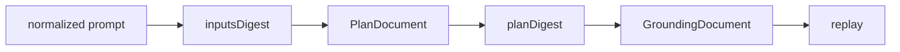

# Ambercast Plan Specification

## Status {#status}

This specification describes the artifacts accepted by ambercast 0.3.1. The implementation accepts Plan schema version 2 and Grounding schema version 1. [repo:src/core/ir/schema.ts:57] [repo:src/core/ir/schema.ts:64]

## Normative language {#normative-language}

The words **MUST**, **SHOULD**, and **MAY** are to be interpreted as RFC 2119 requirement words. A conforming producer MUST emit only the versions and structures defined here; a consumer MUST reject a structure it cannot validate.

## Dependency model {#dependency-model}

Every digest path MUST use [[spec/canonical-json#digest-form]]. `inputsDigest` binds normalized prompt, schema, producer inputs, and targets; `planDigest` binds replay-relevant plan content. [repo:src/core/ir/digest.ts:91] [repo:src/core/ir/digest.ts:118]

## Compatibility {#compatibility}

| Artifact | Accepted value | Evidence |
| --- | --- | --- |
| Plan `schemaVersion` | `2` | repo:src/core/ir/schema.ts:57 |
| Grounding `schemaVersion` | `1` | repo:src/core/ir/schema.ts:64 |
| Fingerprint algorithm | `a11y-neighborhood-v2` | repo:src/core/ir/schema.ts:221 |
| Report `schemaVersion` | `3.3` | repo:src/report/schema.ts:30 |

## Reading order {#reading-order}

Read [[spec/plan-document#document-shape]], [[spec/steps#step-union]], and [[spec/value-types#shared-types]] first; then [[spec/freshness#inputs-digest]], [[spec/grounding-document#grounding-shape]], and [[spec/fingerprint#algorithm]]. Implementers MUST finish with [[spec/canonical-json#digest-form]], [[spec/secrets#authorization]], and [[spec/conformance#semantic-validation]].

## Rationale {#rationale}

The problem is that readers must distinguish authored intent from derived execution and volatile grounding before they can safely interpret fields. 

The selected dependency-first presentation makes digest boundaries and compatibility versions visible before the detailed schemas. 

One rejected alternative was a single undifferentiated artifact; it was rejected because plan and UI evidence have different invalidation rules. Another was chapter-local versioning; it was rejected because compatibility is a document-system contract.  
