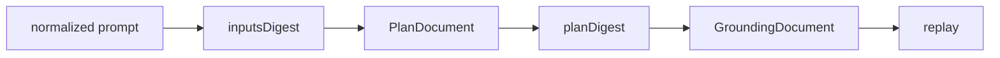

## ステータス {#status}

本仕様は、ambercast 0.3.1 が受け付けるアーティファクトについて記述する。本実装は、Plan スキーマバージョン 2 および Grounding スキーマバージョン 1 を受け付ける。[src/core/ir/schema.ts:57](https://github.com/kotarotsubaki/ambercast/blob/v0.3.1/src/core/ir/schema.ts#L57) [src/core/ir/schema.ts:64](https://github.com/kotarotsubaki/ambercast/blob/v0.3.1/src/core/ir/schema.ts#L64)

## 規範的文言 {#normative-language}

単語 **MUST**、**SHOULD**、および **MAY** は、RFC 2119 の要求語として解釈されるものとする。適合するプロデューサは、ここで定義されたバージョンおよび構造のみを出力しなければならない（MUST）。コンシューマは、自身が検証できない構造を拒絶しなければならない（MUST）。

## 依存関係モデル {#dependency-model}

すべてのダイジェストパスは、[正準 JSON](/ambercast/ja/spec/canonical-json/#digest-form) を使用しなければならない（MUST）。`inputsDigest` は正規化されたプロンプト、スキーマ、プロデューサ入力、およびターゲットをバインドし、`planDigest` はリプレイに関連する計画内容をバインドする。[src/core/ir/digest.ts:91](https://github.com/kotarotsubaki/ambercast/blob/v0.3.1/src/core/ir/digest.ts#L91) [src/core/ir/digest.ts:118](https://github.com/kotarotsubaki/ambercast/blob/v0.3.1/src/core/ir/digest.ts#L118)

## 互換性 {#compatibility}

| アーティファクト | 受け付ける値 | 根拠 |
| --- | --- | --- |
| Plan `schemaVersion` | `2` | [src/core/ir/schema.ts:57](https://github.com/kotarotsubaki/ambercast/blob/v0.3.1/src/core/ir/schema.ts#L57) |
| Grounding `schemaVersion` | `1` | [src/core/ir/schema.ts:64](https://github.com/kotarotsubaki/ambercast/blob/v0.3.1/src/core/ir/schema.ts#L64) |
| Fingerprint アルゴリズム | `a11y-neighborhood-v2` | [src/core/ir/schema.ts:221](https://github.com/kotarotsubaki/ambercast/blob/v0.3.1/src/core/ir/schema.ts#L221) |
| Report `schemaVersion` | `3.3` | [src/report/schema.ts:30](https://github.com/kotarotsubaki/ambercast/blob/v0.3.1/src/report/schema.ts#L30) |

## 読解順序 {#reading-order}

まず [計画ドキュメント](/ambercast/ja/spec/plan-document/#document-shape)、[ステップ](/ambercast/ja/spec/steps/#step-union)、および [値型](/ambercast/ja/spec/value-types/#shared-types) を読み、次に [鮮度とダイジェスト](/ambercast/ja/spec/freshness/#inputs-digest)、[グラウンディングドキュメント](/ambercast/ja/spec/grounding-document/#grounding-shape)、および [要素フィンガープリント](/ambercast/ja/spec/fingerprint/#algorithm) を読むこと。実装者は、最後に [正準 JSON](/ambercast/ja/spec/canonical-json/#digest-form)、[プランにおけるシークレット](/ambercast/ja/spec/secrets/#authorization)、および [適合性](/ambercast/ja/spec/conformance/#semantic-validation) を読まなければならない（MUST）。

## 設計根拠 {#rationale}

問題は、読者がフィールドを安全に解釈できるようになる前に、作成された意図を、派生した実行および揮発的なグラウンディングから区別しなければならないことである。

選定された依存関係優先の提示構成により、詳細なスキーマに先立ってダイジェスト境界と互換性バージョンが可視化される。

却下された代替案の1つは、単一の未分化なアーティファクトであった。計画と UI エビデンスでは無効化ルールが異なるため、これは却下された。もう1つは章ごとの局所的なバージョニングであった。互換性はドキュメントシステム全体の規約であるため、これは却下された。 
